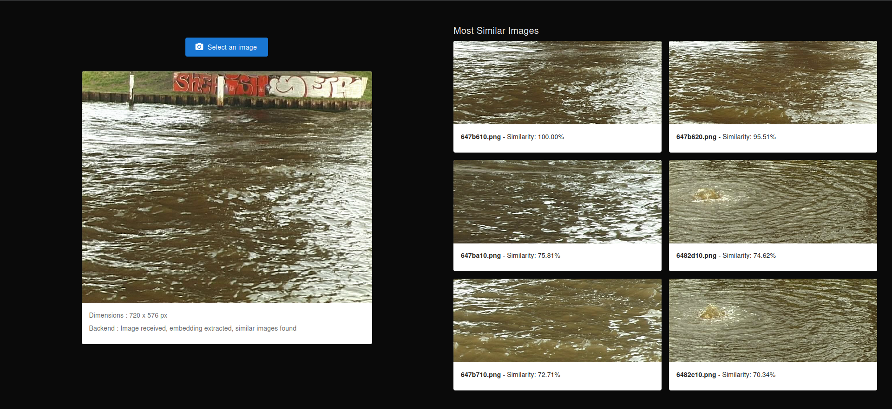
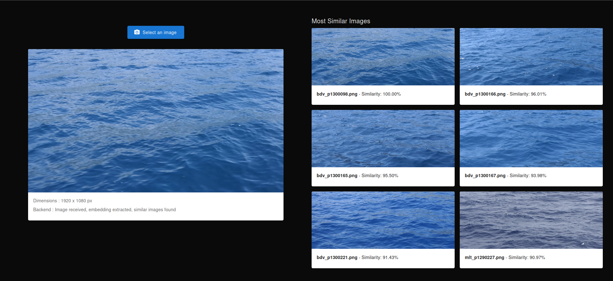
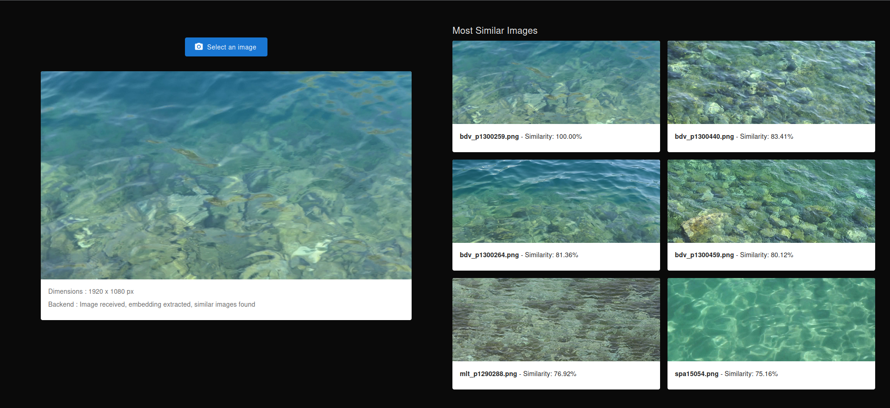
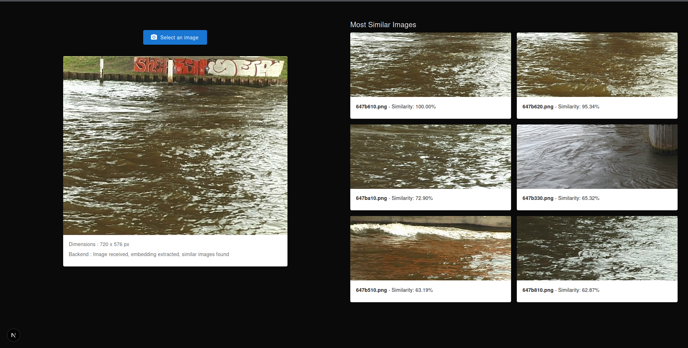
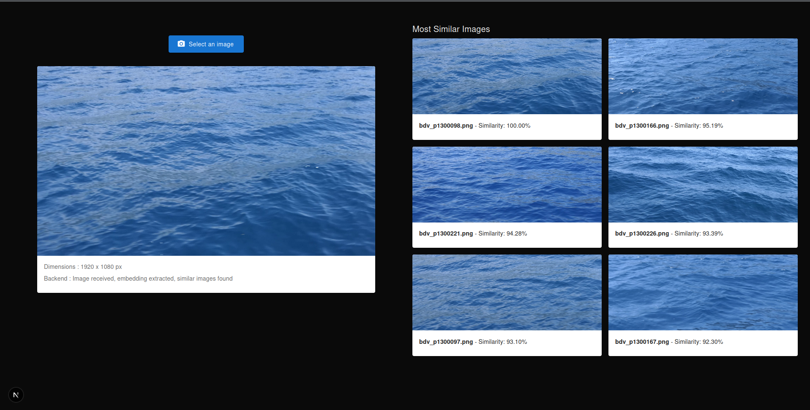
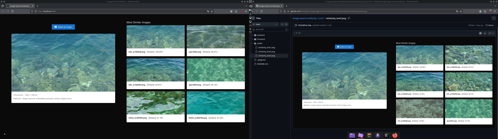

# Image Search Similarity

This project is part of a research internship aiming to develop an AI system that finds images similar to a given input image. The solution uses deep learning embeddings and cosine similarity to compare images based on their visual features.

---

## Project Overview

The goal of this project is to:
  - Enable users to upload an image via a Next.js frontend.
  - The image is then sent to a FastAPI backend.
  - The backend computes a feature embedding of the input image using a pre-trained deep learning model (EfficientNet-b0).
  - The system then compares this embedding against pre-computed embeddings of images from a local dataset.
  - Using cosine similarity, the backend returns the top 5 most similar images to the input image.

Here's an example of some of the tests I ran. EfficientNet offers several models ranging from B0 to B7. B0 is the fastest of all but offers the worst results. B7 is the slowest but is the most accurate. Since I ran my tests in a web application, I wanted it to be fast enough so I wouldn't have to wait. I ran a first test with the B0 version, which was very conclusive. Here are the results :







Since I had excellent execution speed for the B0 model and really conclusive results, I decided to switch to the B4 model. There is a very slight latency (with a database of almost 700 images) but the results are really better. For web application performance reasons, I did not test with a model higher than B4. Here are the tests for the B4 model :







---

## Project Structure

```bash
image-search-similarity/
│
├── frontend/           # Next.js application
│
├── backend/            # FastAPI backend
│   ├── images_database/  # Folder where you store your image dataset
│   ├── embeddings/       # Folder where the image embeddings will be saved
│   └── main.py           # Backend API code
│
├── README.md            # Project documentation
```

---

## Prerequisites
  - Python 3.9+
  - Node.js & npm
  - (Recommended) Virtual environment for Python

---

## Setup Instructions

### Backend

```bash
cd backend
python -m venv venv && source venv/bin/activate
pip install -r requirements.txt
mkdir images_database embeddings
```

Then put your image database in the "images_database" folder. You need to encode all the images in your images_database/ folder into embedding vectors with EfficientNet (or another one of your choice), then store them in the embeddings/ folder. To do this, run the file "encode_embeddings.py".

```bash
python utils/encode_embeddings.py
```

Finally, run the backend API:

```bash
uvicorn main:app --reload
```

### Frontend

```bash
cd frontend
npm install
npm run dev
```
